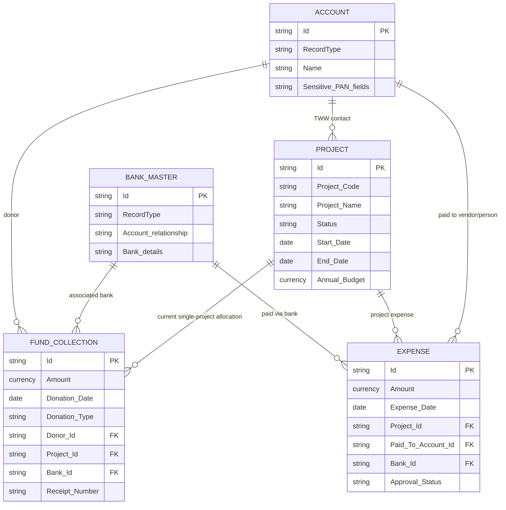
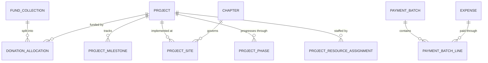

# Living data model

**Status:** Living architecture document

**Last verified:** 2026-08-08

**Environment:** `twwdev` development sandbox

**Scope:** Salesforce system of record, internal applications, public/external experiences, reporting, and future headless React journeys

## Purpose

This document is the maintained source of truth for the Together We Will data model. It records:

- objects required by the source workbooks and user stories;
- objects and functionality verified in `twwdev`;
- the recommended canonical model;
- proposed additions, overlaps, conflicts, and unresolved decisions; and
- the evidence and change history needed to update the model safely.

A proposed object does not become approved merely because it appears here. Approved changes must be implemented through reviewed Salesforce metadata and recorded in the change history.

## Status vocabulary

| Status | Meaning |
|---|---|
| `Verified` | Confirmed through a read-only `twwdev` metadata or schema check. |
| `Requirement` | Explicitly present in a requirement workbook or user story. |
| `Recommended` | Preferred canonical use, pending approval where noted. |
| `Proposed` | Candidate object or relationship that does not yet exist. |
| `Decision needed` | Overlap or ambiguity that must be resolved before implementation. |
| `Later phase` | In scope, but not required for the first application slice. |

## Source baseline

The baseline review used:

- `role_hierarchy.xlsx`;
- `TWW_Object_CRUD_Permissions_Matrix.xlsx`;
- `User_Stories_Manually_Edited.xlsx`; and
- a read-only metadata, schema, automation, UI, report, and dashboard audit of `twwdev` on 2026-08-08.

The workbooks are source inputs, not automatically authoritative configuration. Conflicts are recorded here and resolved through a decision record.

## Executive model recommendation

The first application phase should reuse the existing core model rather than create parallel objects:

| Domain | Recommended canonical model | Approval state |
|---|---|---|
| Donors, volunteers, vendors, and partners | Standard `Account` and Person Account with record types; `Contact` for people associated with organizations | Recommended |
| Projects | Existing `Project__c` | Recommended |
| Donations | Existing `Fund_Collection__c` for Phase 1 | Decision needed |
| Donation-to-project splits | Proposed `Donation_Allocation__c` junction | Decision needed |
| Expenses | Existing `Expense__c` | Recommended |
| Bank accounts | Existing `Bank_Master__c` | Recommended; overlap review required |
| Staff | Standard `Employee`, not the documented `Employee__c` | Decision needed |
| Attendance | Existing `Employee_Attendance__c` | Later phase |
| Compliance documents | Existing `Company_Document__c` plus Salesforce Files | Recommended |
| Volunteer intake | Standard `Case`, converted to a Volunteer Account after approval | Recommended |
| Campaign participation | Standard `Campaign` and `CampaignMember` | Recommended |
| Engagement history | Standard `Task` and `Event` | Recommended |
| Website content | Existing `TWW_Content__mdt` until a content-platform decision replaces it | Recommended |

## Current verified core relationships

This diagram shows relationships verified in the current core schema. It intentionally omits proposed objects.

The current donation model supports one project lookup per fund-collection record. Multi-project allocation therefore needs a junction object or a deliberate redesign.

## Explicit CRUD requirement objects

| Requirement name | Classification | `twwdev` finding | Direction |
|---|---|---|---|
| `Account` | Standard | Exists with donor, volunteer, vendor, CSR, NGO, IT, online-platform, household, and organization record types | Reuse |
| `Project__c` | Custom | Exists with project fields, record page, validations, reports, and fund rollups | Reuse |
| `Expense__c` | Custom | Exists with Actual, Indicative, and Material record types | Reuse |
| `Fund_Collection__c` | Custom | Exists with Cash, Corporate, In-Kind, and Grant record types | Reuse for Phase 1, pending canonical decision |
| `Compensation_Plan__c` | Custom | Exists with Standard, Contract, and Executive record types | Later HR phase |
| `Bank_Master__c` | Custom | Exists with TWW, Vendor, and Partner bank-account record types | Reuse after overlap review |
| `Employee__c` | Custom in workbook | Does not exist as a TWW custom object; standard `Employee` is configured | Normalize requirement to standard `Employee` |
| `Employee_Attendance__c` | Custom | Exists with Regular, Field, Leave, Holiday, and Work From Home record types | Later HR phase |

## Standard objects in scope

| Object | Use | Current state |
|---|---|---|
| `Account` / Person Account | Donors, volunteers, vendors, CSR partners, NGOs, and other partners | Verified and configured |
| `Contact` | People associated with organizational accounts | Verified |
| `Employee` | Staff and internal resources | Verified with employee record types |
| `Campaign` | Fundraising and volunteer campaigns | Available; journey configuration pending |
| `CampaignMember` | Campaign registration and participation | Available; journey configuration pending |
| `Case` | Public volunteer enquiry and registration intake | Verified through volunteer Web-to-Case services |
| `Task` and `Event` | Donor, volunteer, and partner engagement history | Available; canonical engagement model pending |
| `ContentDocument`, `ContentVersion`, and `ContentDocumentLink` | Files, version history, and document associations | Verified through document controllers and LWCs |
| `Opportunity` | NPSP donation/fundraising model | Installed; overlaps current `Fund_Collection__c` architecture |
| `User` | Internal users under the 10-license constraint | Verified |
| `PermissionSet` and `PermissionSetGroup` | Feature and persona access | Security-by-feature design pending |
| `Report` and `Dashboard` | Operational and executive analytics | 55 reports and 8 dashboards identified during audit |

## Existing custom data objects

| Object | Purpose or evidence | Disposition |
|---|---|---|
| `Project__c` | Project status, dates, budgets, location, contribution, and impact | Core |
| `Fund_Collection__c` | Donations, in-kind contributions, grants, banks, projects, and receipts | Core for Phase 1 |
| `Expense__c` | Project expenses, vendors, payments, validation, and approval | Core |
| `Bank_Master__c` | TWW, vendor, and partner bank accounts | Core after duplication review |
| `Company_Document__c` | Document metadata, email sharing, and version management | Reuse and extend for compliance |
| `Project_Volunteer_Mapping__c` | Volunteer-to-project assignment | Reuse after relationship verification |
| `Financial_Aggregator__c` | Monthly financial reporting snapshots | Reuse initially; verify necessity over time |
| `Compensation_Plan__c` | Compensation configuration | Later HR phase |
| `Employee_Attendance__c` | Attendance tracking | Later HR phase |
| `Student__c` | Student records and possible beneficiary use | Decision needed |
| `Bank_Information__c` | Additional bank-information model | Possible duplicate of `Bank_Master__c` |
| `FundFlow__c` | Additional Fund model | Possible duplicate of `Fund_Collection__c` / NPSP fundraising model |
| `BenefitManagementRecertification__c` | Benefit recertification flow data | Relevance to TWW scope not established |

## Configuration metadata in scope

| Metadata | Use | Current state |
|---|---|---|
| `TWW_Content__mdt` | Public website content by category | Verified through `TWWPortalController` |
| Partner engagement threshold metadata | Partner-category or engagement configuration | Present; detailed use requires validation |

## Existing functionality mapped to objects

### Donation and receipts

`Fund_Collection__c` currently supports:

- cash, corporate, in-kind, and grant record types;
- donor, project, and associated-bank relationships;
- anonymous-donor fields, including an encrypted anonymous-name field;
- cash-donation and future-date validation;
- a `donationRecorder` LWC;
- receipt generation, download, amount-in-words, and 80G-related fields;
- project fund-raised rollups; and
- donor last-payment-date updates.

### Monthly commitments

Account fields and Apex services exist for committed amounts, missing-donation detection, reminders, and reconciliation. Schedulable classes exist, but the 2026-08-08 scheduled-job audit did not show the TWW monthly or financial schedulers as active scheduled jobs.

### Expenses

`Expense__c` supports Actual, Indicative, and Material record types; project, paid-to Account, and bank relationships; payment and approval statuses; mandatory-field validation; and one active Expense Approval Process.

### Documents and compliance

`Company_Document__c` and Salesforce Files support selecting and emailing documents, uploading versions, displaying version history, searching, downloading, and controlled version deletion. Compliance types, expiry alerts, retention, and approval are not complete.

### Volunteers and public experience

The org contains a Volunteer Account record type, Volunteer Case record type, registration and Web-to-Case LWCs, duplicate prevention, Experience Cloud authentication/self-registration, and public home/content/contact/volunteer components. The existing public implementation is predominantly LWC and Apex. Future React work must preserve working journeys until parity is demonstrated.

### Analytics

The current implementation includes detailed fund and expense reports, cumulative and monthly-financial dashboards, a financial aggregation batch, and a data-stewardship LWC with CSV export.

## Proposed additions

No proposed object should be created until its decision and relationship design are approved.

| Proposed object | Purpose | Phase | Alternative considered |
|---|---|---|---|
| `Donation_Allocation__c` | Split one donation among multiple projects and enforce a 100% allocation total | Phase 1 | Redesign donations around NPSP Opportunity |
| `Project_Milestone__c` | Milestone name, owner, target date, status, and completion | Phase 2 | Standard tasks only |
| `Project_Site__c` | Multiple implementation sites and geographic reporting per project | Phase 1/2 | Fields directly on `Project__c` |
| `Project_Phase__c` | Project phases, dates, status, and sequence | Phase 2 | Project status picklist only |
| `Chapter__c` | Geographic chapter migration, ownership, and sharing | Phase 2 | Account record type or territory model |
| `Project_Resource_Assignment__c` | Assign staff and non-volunteer resources to projects | Phase 2 | Extend `Project_Volunteer_Mapping__c` |
| `Payment_Batch__c` | Group approved expenses into a bank instruction batch | Phase 2 | Export directly from Expense |
| `Payment_Batch_Line__c` | Payment instruction, execution status, and reconciliation per expense | Phase 2 | Fields directly on Expense |
| `Beneficiary__c` | Generic beneficiary model if students are only one beneficiary type | Phase 1/2 | Extend `Student__c` or use a standard nonprofit object |

## Target relationship additions under consideration

## Avoid creating duplicate objects

Unless a future decision proves the standard model insufficient, do not create separate custom objects for Vendor, CSR Partner, Volunteer Campaign, campaign participation, donor/partner engagement, document versions, or public volunteer intake. Use the relevant Account record type, `Campaign`, `CampaignMember`, `Task`, `Event`, Salesforce Files, and `Case`.

## Known conflicts and risks

### Employee model mismatch

The CRUD workbook names `Employee__c`, but `twwdev` uses standard `Employee` with Contract, Full Time, Intern, Part Time, and Volunteer record types.

### Donation architecture overlap

The org contains custom `Fund_Collection__c`, NPSP Opportunity/payment/recurring-donation functionality, and `FundFlow__c`. The recommended Phase 1 direction is to preserve `Fund_Collection__c` while documenting a later consolidation decision.

### Bank-model overlap

Both `Bank_Master__c` and `Bank_Information__c` exist. Their fields, users, and record populations must be compared before either is extended.

### Beneficiary ambiguity

`Student__c` exists, while the stories refer more broadly to beneficiaries. Decide whether students are the only beneficiary type before extending the object.

### Stale removed-object reference

`DataStewardshipReportService` still references `Project_Expense_Mapping__c`, while the change-request sheet records removal of that mapping. Remove or safely handle the reference before treating the stewardship report as complete.

### PAN and sensitive-field conflict

The security story requests encryption for PAN and bank details, while the change request asks for PAN to be read-only for most users and editable for administrators. Current PAN fields are not consistently encrypted. Field visibility alone is not encryption.

### Scheduled automation gap

Monthly commitment and financial scheduler classes exist, but current TWW schedules were not found. Confirm timing, recipients, volume, idempotency, and monitoring before scheduling them.

## Decision register

| ID | Decision | Recommendation | Status |
|---|---|---|---|
| DM-001 | Phase 1 donation system of record | Keep `Fund_Collection__c` until a separately planned NPSP migration | Pending approval |
| DM-002 | Employee master | Use standard `Employee`; retire `Employee__c` from requirements | Pending approval |
| DM-003 | Multi-project donation allocation | Add `Donation_Allocation__c` | Pending approval |
| DM-004 | Volunteer lifecycle | Case intake → Volunteer Account → Campaign/project assignment | Pending approval |
| DM-005 | Compliance documents | `Company_Document__c` plus Salesforce Files | Pending approval |
| DM-006 | Bank master | Compare `Bank_Master__c` and `Bank_Information__c`; select one canonical object | Investigation pending |
| DM-007 | Beneficiary model | Determine whether `Student__c` is sufficient | Investigation pending |
| DM-008 | PAN protection | Resolve encryption versus field-access requirement | Pending approval |

When a decision is approved, create `docs/decisions/DM-###-short-name.md`, update this table, and update the relevant object rows and diagrams.

## Planned implementation sequence

1. Approve the canonical-object decisions above.
2. Retrieve the approved Salesforce metadata baseline into `salesforce/force-app/`.
3. Stabilize stale references, automated jobs, and duplicate-object risks.
4. Build the Donation Management vertical slice without removing the current LWC experience.
5. Add donation allocation and test receipt, rollup, anonymous-donor, and reporting behavior.
6. Build project and expense journeys.
7. Add compliance, volunteer, outreach, and payment capabilities by phase.
8. Apply CRUD, field security, and sharing as each feature is completed.

## Maintenance procedure

Update this document whenever an object, relationship, canonical decision, or important automation changes.

1. Verify current org metadata and requirements.
2. Update the object catalog and relationship diagram.
3. Update the decision register.
4. Add a dated change-history entry.
5. Link the implementation worklog and pull request.
6. Update the public progress dashboard when the change affects a reported outcome or phase.

Do not record access tokens, authentication URLs, real donor or beneficiary data, bank details, PAN/Aadhar values, or other sensitive record data in this repository.

## Change history

| Date | Change | Evidence | Pull request |
|---|---|---|---|
| 2026-08-08 | Created the living data model from the source workbooks and a read-only `twwdev` audit. | Object schema, record types, Apex, triggers, LWCs, flows, approval process, validation rules, reports, and dashboards | [PR #2](https://github.com/RohanDhameja/tww-salesforce-implementation/pull/2) |
